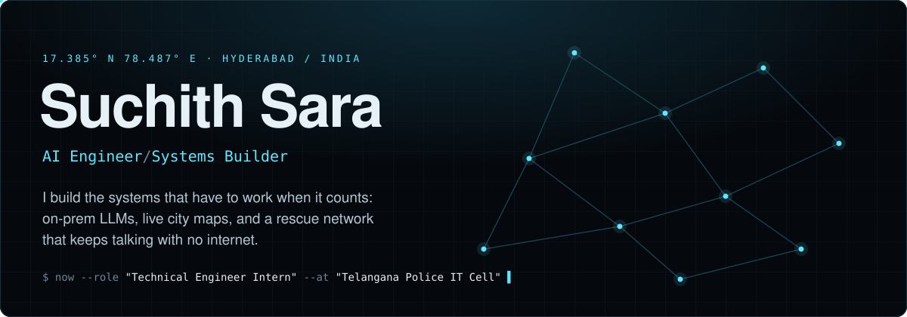
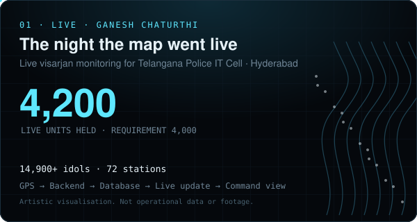
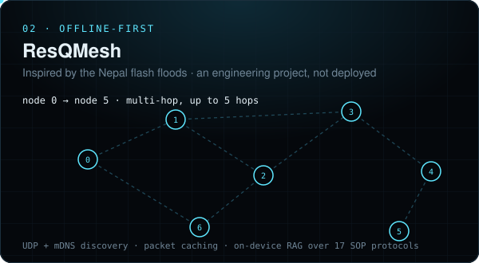
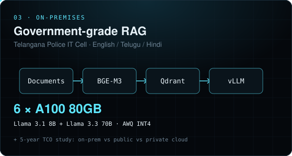
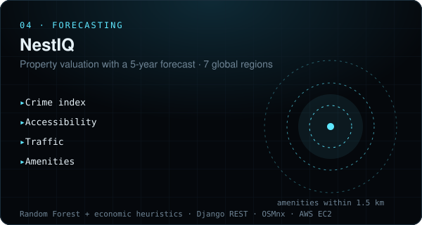

<div align="center">

<a href="https://suchith-sara.vercel.app/">
  
</a>

<br>

### 🎬 &nbsp;[**Watch my work as a 90-second film → suchith-sara.vercel.app**](https://suchith-sara.vercel.app/)

<sub>Eight scenes, played by scroll. Press <kbd>Space</kbd> to play, <kbd>M</kbd> for sound. Also at <a href="https://suchithsara.com">suchithsara.com</a>.</sub>

<br>

<a href="https://suchith-sara.vercel.app/"></a>
<a href="https://www.linkedin.com/in/suchith-sara-903133339/"></a>
<a href="https://suchithsara.com/Suchith_Sara_Resume.pdf"></a>

</div>


## What I do

I'm a Python engineer with **7+ months of internship experience** in backend engineering and applied AI, finishing a B.Tech in Computer Science & Information Technology at CMR Technical Campus (2023–2027).

The through-line in my work: **systems that can't be allowed to fail.** A multilingual LLM stack that has to stay inside a government network. A live map that a city's police watch on the busiest night of the year. A rescue network built for the moment the internet goes away.

<br>

## Selected work

<table>
<tr>
<td width="50%" valign="top"><a href="https://suchith-sara.vercel.app/"></a></td>
<td width="50%" valign="top"><a href="https://github.com/suchithsaraaaa/resqmesh"></a></td>
</tr>
<tr>
<td width="50%" valign="top"><a href="https://suchith-sara.vercel.app/"></a></td>
<td width="50%" valign="top"><a href="https://github.com/suchithsaraaaa/integrated_predictor"></a></td>
</tr>
</table>

<details open>
<summary><b>01 &nbsp;The night the map went live</b> &nbsp;<sub>Telangana Police IT Cell · Ganesh Chaturthi</sub></summary>
<br>

A live tracking system for Hyderabad's visarjan: GPS from the field, through a backend and database, to a live command view. The requirement was **4,000** tracked units; the system held **4,200**, across **14,900+ idols** and **72 stations**.
The full story, told as a scene in the film: [suchith-sara.vercel.app](https://suchith-sara.vercel.app/).

</details>

<details open>
<summary><b>02 &nbsp;ResQMesh</b> &nbsp;<sub>offline-first emergency response · <a href="https://github.com/suchithsaraaaa/resqmesh">repo</a> · <a href="https://res-q-mesh-cinematic-website--suchithssara.replit.app/">site</a></sub></summary>
<br>

Inspired by the Nepal flash floods. When towers and cloud go down, ResQMesh keeps working: **no cloud infrastructure, no external APIs.**

- **Peer-to-peer mesh** with UDP + mDNS discovery, multi-hop relay (up to 5 hops), packet caching and link-quality metrics
- **On-device RAG** over 17 protocols from NDMA, WHO, IFRC and INSARAG
- **Incident correlation** that spots duplicate reports from different people and merges them
- **Offline GIS** with MapLibre, plus a Three.js globe
- FastAPI · SQLite · Electron · React

*An engineering project inspired by the problem. Not deployed in any response.*

</details>

<details open>
<summary><b>03 &nbsp;On-premises RAG for government</b> &nbsp;<sub>Telangana Police IT Cell</sub></summary>
<br>

- Architected an on-prem retrieval-augmented generation system: LLM selection, infrastructure sizing, deployment planning
- **Two-tier LLMs**: Llama 3.1 8B + Llama 3.3 70B (AWQ INT4) on vLLM across **6 × NVIDIA A100 80GB**
- **Multilingual retrieval** in English, Telugu and Hindi with BGE-M3 and Qdrant
- Bulk processing and AI enrichment of memo PDFs with the Anthropic API
- A **5-year TCO analysis**: on-premises vs public vs private cloud

</details>

<details open>
<summary><b>04 &nbsp;NestIQ</b> &nbsp;<sub>real estate forecasting · <a href="https://github.com/suchithsaraaaa/integrated_predictor">repo</a></sub></summary>
<br>

Prices the *place*, not just the building. Crime, accessibility, traffic and amenities within 1.5 km shape a **5-year forecast across 7 regions**. Random Forest plus economic heuristics, served by Django REST, with OSMnx / Shapely / Geopy for the geospatial layers, deployed on AWS EC2 behind Nginx.

</details>


## Path so far

| When | Where | What |
|:--|:--|:--|
| **Sep 2026 → now** | Telangana Police IT Cell | Technical Engineer Intern |
| May – Jun 2026 | Telangana Police IT Cell | AI/ML and Full Stack Intern: on-prem RAG, multilingual retrieval |
| Feb – Sep 2025 | Meta SciFor Technologies | Python Developer Intern: **20+ secure REST APIs** (OAuth2, Django, Flask), queries and storage **40% faster/leaner**, **7+ workflows** automated |
| Jul – Dec 2025 | Google, CMR Technical Campus | Campus Ambassador: **1,000+ students**, 10+ events, participation **+35%** |
| Jan 2024 – Jul 2026 | Lexis Club | Treasurer and core committee: budgets and sponsors for 15+ workshops |
| Oct – Dec 2024 | AWS Academy | Cloud virtual internship |

National hackathon finalist. Certified in AWS Academy Cloud Architecting and Cloud Foundations, ServiceNow CSA and CAD, DLT and Hedera Network, and Generative AI Tools.

## Toolbox

```text
Languages   Python · SQL · TypeScript · JavaScript
AI / ML     LLMs · RAG · NLP · Computer vision · scikit-learn · XGBoost
AI infra    vLLM · Llama 3.x · BGE-M3 · Qdrant · Anthropic API
Backend     Django · DRF · Flask · FastAPI · OAuth2 · webhooks
Frontend    React · Next.js · Electron · Three.js · MapLibre
Data        PostgreSQL · SQLite · MongoDB · pandas · NumPy
Cloud       AWS (EC2 · S3 · IAM) · Docker · Nginx · Gunicorn · Linux · Git
```

## Other things on this profile

| | |
|:--|:--|
| 🎞️ [**suchith-sara**](https://github.com/suchithsaraaaa/suchith-sara) | The film above. Next.js static export; scroll-driven video, a generative score synthesised in Web Audio, no server |
| 🤖 [**job-autopilot**](https://github.com/suchithsaraaaa/job-autopilot) | Finds jobs on companies' own boards, tailors a resume per job *without inventing anything*, and sends it to Telegram. Runs free on GitHub Actions |
| 📈 [**crypto-risk-analysis**](https://github.com/suchithsaraaaa/crypto-risk-analysis) | Streamlit dashboard: ML price prediction and live risk monitoring |
| 🎥 [**videochatapp**](https://github.com/suchithsaraaaa/videochatapp) | WebRTC video conferencing with rooms and screen sharing |
| 🔗 [**blockchain-memo-authenticator**](https://github.com/suchithsaraaaa/blockchain-memo-authenticator) | [Live demo](https://v0-blockchain-memo-authenticator.vercel.app) |

<br>

<div align="center">

**Want to build something that can't fail?**

[suchith-sara.vercel.app](https://suchith-sara.vercel.app/) &nbsp;·&nbsp; [suchithsara.work@gmail.com](mailto:suchithsara.work@gmail.com) &nbsp;·&nbsp; [LinkedIn](https://www.linkedin.com/in/suchith-sara-903133339/)

<sub>17.385° N · 78.487° E</sub>

</div>
